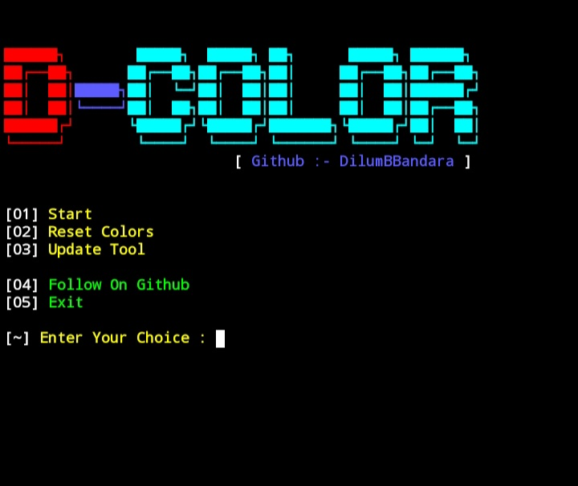
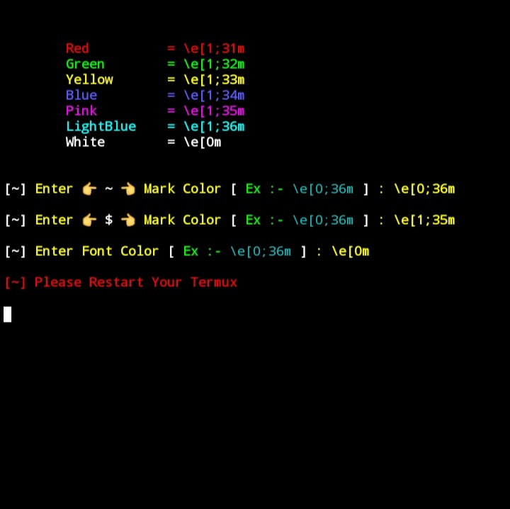
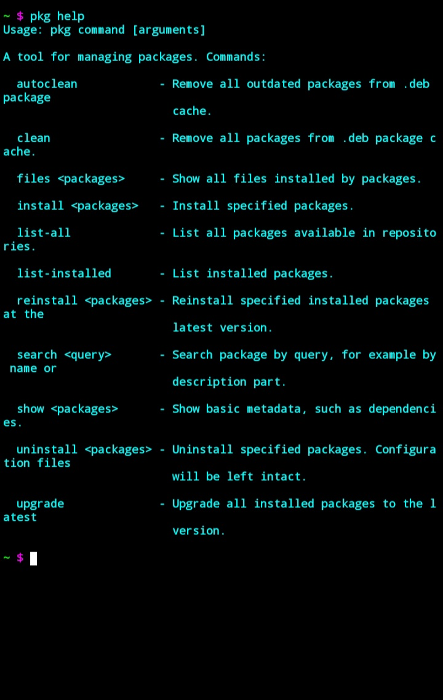

# D-COLOR

 

## AVAILABLE ON :
  
   * `Termux`

## TESTED ON :
   
   * `Termux`

## REQUIREMENTS :

   * `storage 500MB`
   * `python`
   * `git`
   * `ruby`
   * `figlet`
   * `lolcat`
   * `internet`

## INSTALLATION TERMUX :

    apt update && apt upgrade -y
    apt install git -y
    apt install python -y
    git clone https://github.com/DilumBBandara/D-COLOR.git
    cd D-COLOR
    bash setup.sh
    python color.py

## SCREEN SHOTS :

    
    
    

